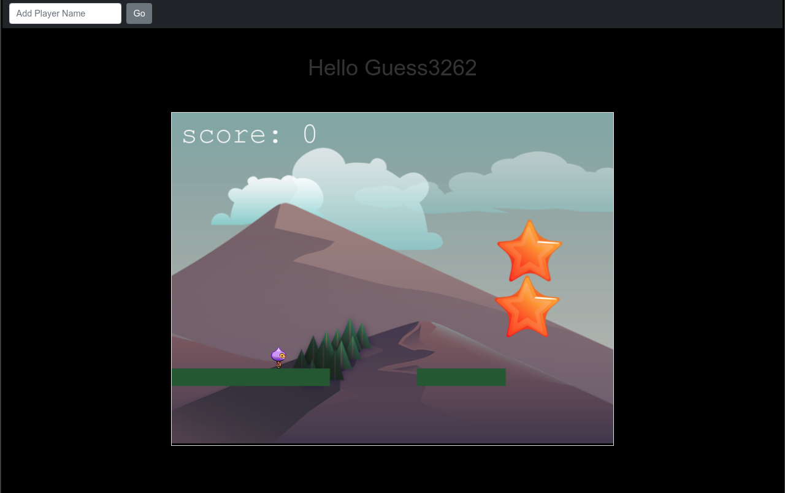

# Runner-Game

## About

This is a platform runner game developed using Phaser 3 library. The main character has to stay safe jumping between platforms and avoiding bombs.

The score is increased by catching stars and a new bomb spawns every time a star is collected.

You can get a guest name or you can provide one, and once the player dies, your score will be submitted to leaderboard API, only the 10 top scores will appear.

My initial objectives for this game were:

- Make the game functional
- Make the game fun
- Make the game appealing

So far, it is functional and appealing, it is needed more time to achieve all the objectives. 
This could be achieved with more scenes with a more complex story and better animations.

## Live View

[Live View](https://60da4ea939b16a0007df9f39--cranky-rosalind-3f540f.netlify.app/)

## Built with

- HTML
- Bootstrap
- JavaScript
- Webpack
- Package.json
- Phaser3
- Jest

## Getting started

### Prerequisites

- Text editor (strongly recommended VS Code)
- Empty directory where the repo is to be cloned
- Using NPM package and JavaScript knowledge to build and test the game.

### To get a local copy of this repo

Run the following comands in the terminal in the next order:

- Step 1:  
  $ cd "here comes the path of your selected directory (double quotes must not be here)"

- Step 2:
  $ git clone https://github.com/Wusinho/Game-Runner/tree/Dev-feature

### To run this project in your local environment

- Step 1:
  npm install

- Step 2:
  npm run start

### To run the tests for this project in your local environment

- Step1:
  $ npm run watch

- Step2:
  press key 'a' from keyboard to run all test
  $ a

## Authors

👤 **Heber Lazo**

- Github: [@Wusinho](https://github.com/Wusinho)
- LinkedIn: [Heber Lazo](https://www.linkedin.com/in/heber-lazo-benza-523266133/)

## 🤝 Contributing

Contributions, issues and feature requests are welcome!

Feel free to check the [issues page](https://github.com/Wusinho/Game-Runner/issues).

## Acknowledgments

- Microverse
- Anyone whose detailed code inspired the creation of this project.

## 📝 License

This project is [MIT](LICENSE) licensed.

\*\*
Give a ⭐️ if you like this project!

## Acknowledgments

- Microverse
- The Odin Project
- Anyone whose detailed code inspired the creation of this project.
